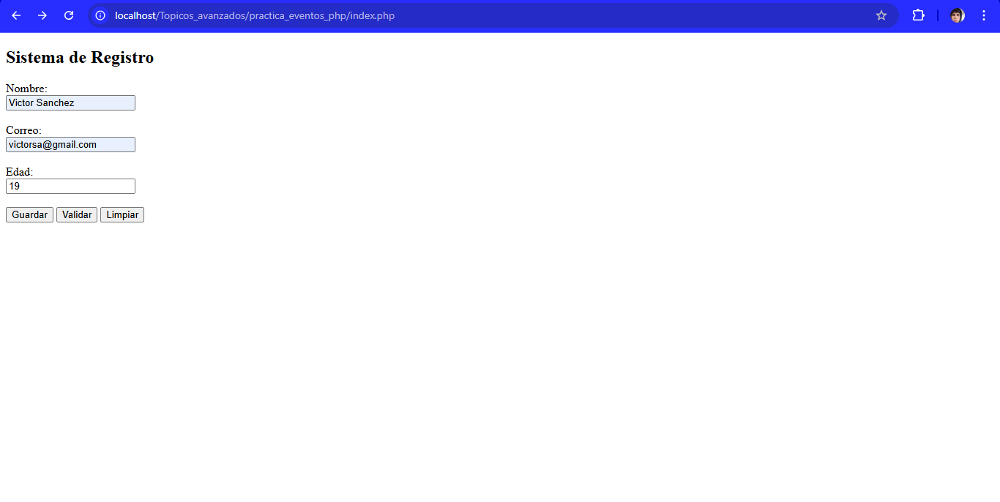
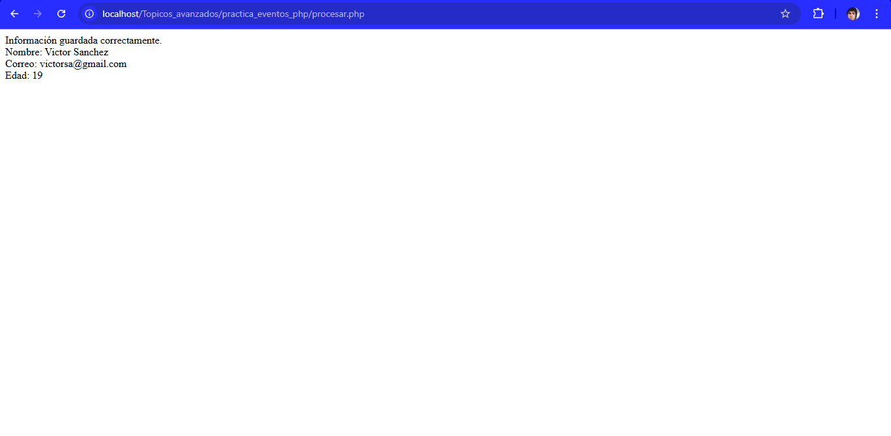
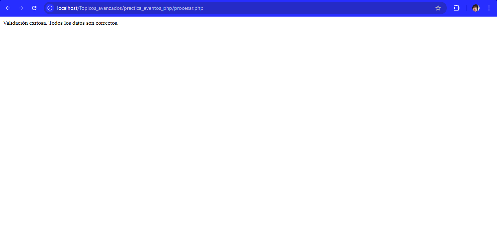

# Práctica – Manejo de Eventos en PHP

## Descripción
Sistema de registro básico desarrollado en PHP que permite capturar información de un usuario mediante un formulario web.

## Funcionalidades
- Registro de nombre, correo y edad
- Manejo de eventos mediante botones
- Envío de datos con método POST

## Eventos manejados
- Guardar información
- Validar datos
- Limpiar formulario

## Validaciones aplicadas
- Campos obligatorios
- Formato correcto de correo
- Edad mayor a cero

## Tecnologías utilizadas
- PHP
- HTML
- Visual Studio Code

## Evidencia
- Capturas del formulario
- Ejecución de eventos de guardar y validar

## Capturas de pantalla

### Formulario principal

### Evento Guardar

### Evento Validar

